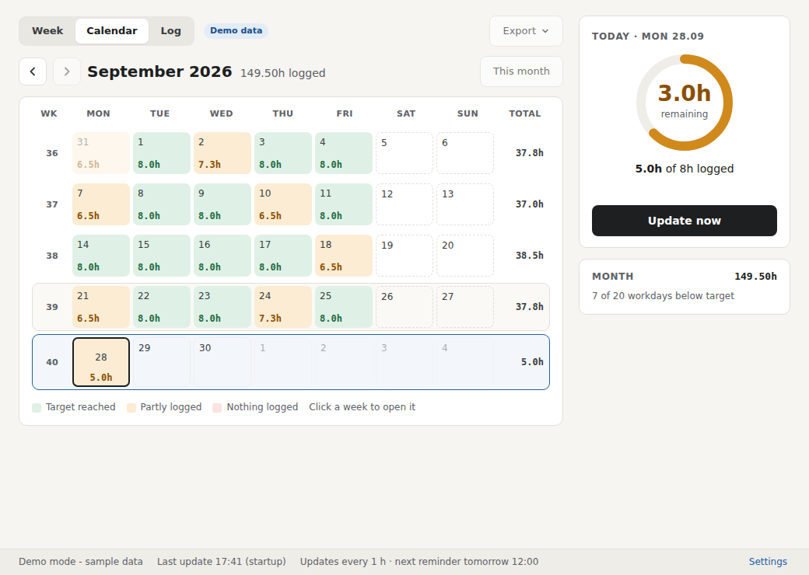
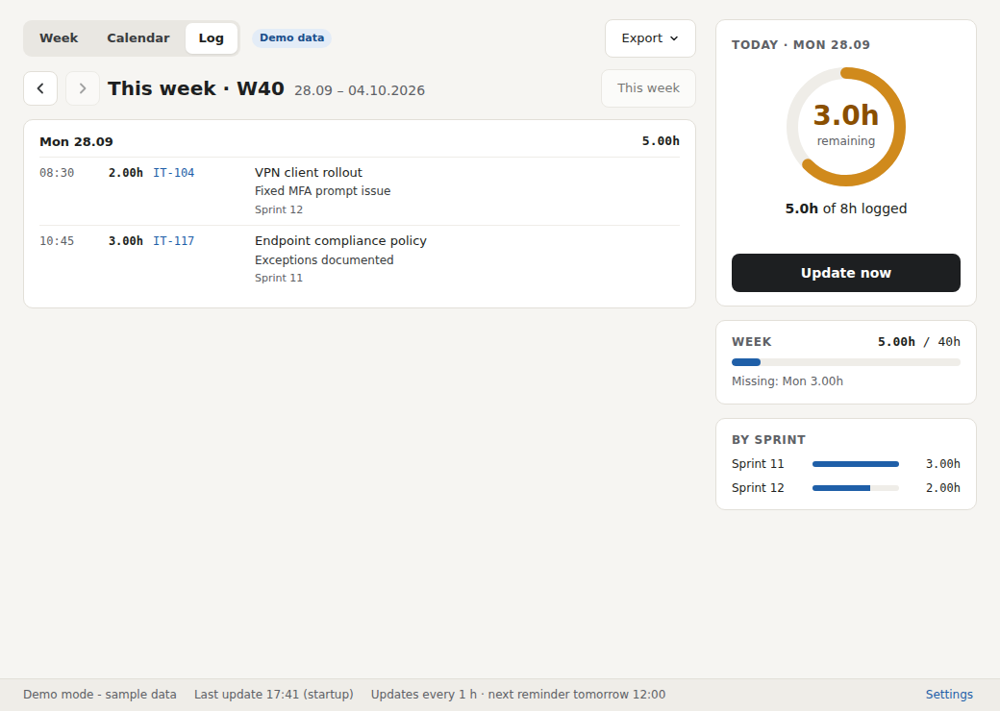
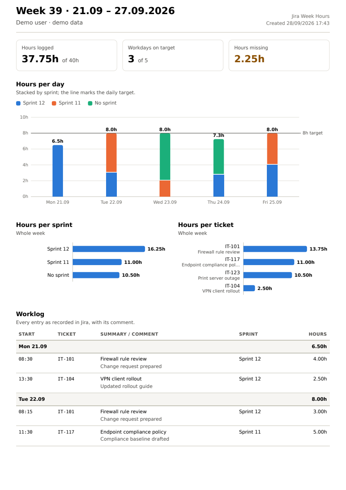
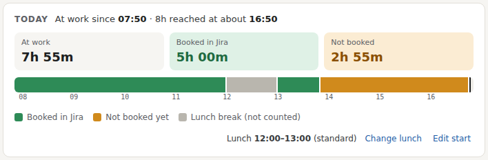
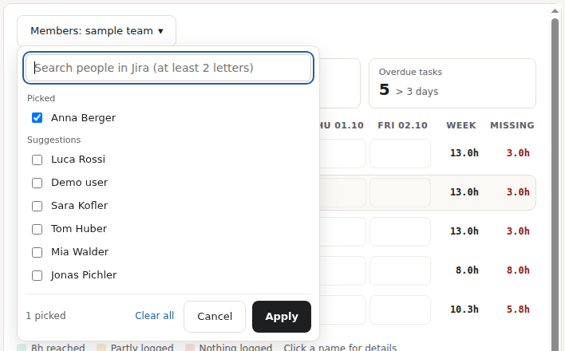
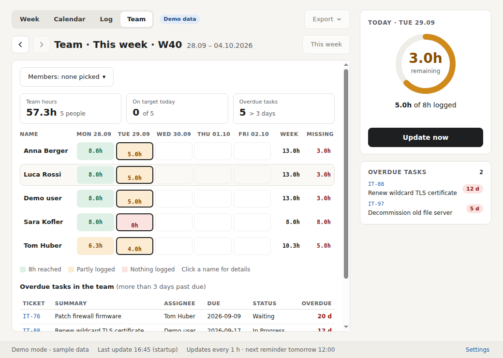

# Jira Week Hours

A small Windows tray app that answers one question: **have I logged my hours in Jira today?**

Jira stores every worklog, but it has no personal day or week view. Jira Week Hours reads your own worklogs and shows how many hours you logged today, how many are still missing against your daily target, and your week by day, sprint and ticket.


| Calendar | Log | PDF report |
|---|---|---|
|  |  |  |

## Features

- **Tray icon** with the hours still missing today; a green check once you reach your target.
- **Week view**: every day with its sprints, tickets and hours, plus weekly totals per sprint.
- **Today's bar**: shows your workday from the start until the daily target. Hours booked in Jira fill it green from the left; it doesn't matter when you entered them. Time at work that isn't booked yet is amber. The lunch break is grey and isn't counted.
- **Lunch break**: set your standard lunch once, and change it for a single day when needed.
- **Browse back** through earlier weeks with the ‹ › arrows; "This week" jumps back.
- **Calendar**: a month view with every day coloured by logged hours (target reached / partly / nothing). Click a week to open it.
- **Log**: every single worklog entry with start time, duration, ticket, sprint and your comment - the protocol as it is stored in Jira.
- **Export** the week as a **PDF report** with bar charts (per day stacked by sprint, per sprint, per ticket) plus the full worklog, or as **CSV** for Excel.
- **Overdue tasks**: your unresolved tasks whose due date is more than *N* days ago (you choose *N*).
- **Team dashboard for project leads and project administrators**: they pick the people they want to see from a member list (search by name, tick the boxes). The dashboard shows hours per person and day, what is missing, each person's sprints and tickets, and their overdue tasks. Everybody else only sees their own hours.
- **Automatic updates** every 15 min to 4 h (your choice, or off), plus reminder times (default 12:00 and 16:00) that notify you if hours are missing. "Update now" works any time.
- **Works with Jira Cloud and Jira Data Center.** Paste your Jira address; the app detects which one it is.
- **Start with Windows**, and closing the window keeps it running in the tray.
- **Read-only.** It never changes anything in Jira and only reads your own worklogs.

## Install

1. Download `JiraWeekHours-Setup.exe` from the [Releases](../../releases) page.
2. Run it. It installs for your user only, with no admin rights, and adds a Start menu entry.
3. Windows SmartScreen may warn because the installer is not code-signed. Click **More info**, then **Run anyway**.

## Connect your Jira

On first start, paste the address you use to open Jira in the browser, for example `https://your-company.atlassian.net` or `https://jira.your-company.com`. A board or ticket link works too; the app keeps just the base address.


Then sign in one of two ways:

| Option | How |
|---|---|
| **Sign in with Jira window** (default) | A Jira window opens. Log in as usual, including company single sign-on. The app remembers the session. |
| **API token**, Jira Cloud | Create a token at [id.atlassian.com › Security › API tokens](https://id.atlassian.com/manage-profile/security/api-tokens). In Settings, choose *API token* and enter your e-mail and the token. |
| **Personal access token**, Jira Data Center | In Jira: your profile › *Personal Access Tokens*. In Settings, choose *API token*, leave the e-mail empty and paste the token. |

Some single sign-on providers (Google in particular) refuse sign-in from embedded windows. If the sign-in window does not work, use a token instead.

**Try it without Jira:** choose *Try it with sample data first* on the connect screen, or tick *Demo mode* in Settings.

## Settings

| Setting | Default | Notes |
|---|---|---|
| Daily target | 8 h | Monday to Friday |
| Update every | 1 hour | Off, 15 min, 30 min, 1 h, 2 h or 4 h - quiet background update |
| Reminder times | 12:00, 16:00 | Update + notification if hours are missing, e.g. `10:00, 12:00, 16:00` |
| Task counts as overdue after | 3 days | Unresolved tasks more than this many days past their due date |
| Lunch break | 12:00-13:00 | Every workday; leave both times empty for none. *Change it for one day* sets different lunch times for one date; without a date it applies to today |
| Extra admin group | *(empty)* | Optional Jira group whose members also see the team dashboard, spelled exactly as in Jira (Settings lists your groups) |
| Team group | *(optional)* | Offered in the member list, and shown while nobody is picked |
| Group hours by | Sprint | Also issue type, project, component, labels or any custom field (`customfield_12345`) |

### Today's bar

The bar runs from the start of your day until the point where the daily target is reached, lunch included. It starts at the first sign of PC use today: Windows starting (if that was today), the app starting, or the first unlock / wake-up. The installer switches on *Start with Windows*, so the app is running from the moment you log in. If the start is wrong (for example you started working before switching on the PC), use **Edit start**.

- **Booked in Jira** (green) = today's worklogs, stacked from the start of the day. The time of day you entered a worklog doesn't matter.
- **Not booked yet** (amber) = time at work so far that is not booked. Book it in Jira as usual (**Book in Jira** opens it), then *Update now*.
- **Lunch break** (grey) is not counted as work time. **Change lunch** changes it for today only; the standard lunch break is in Settings.
- **At work** = now minus the start, minus the lunch break.
- The start time is stored only on your PC (`%APPDATA%\Jira Week Hours\clock.json`, last 60 days). It is never sent to Jira and never appears on the team dashboard.



### Team dashboard

The Team tab is shown to:

- the **project lead** of any project, and
- anyone in a project's **Administrators** role, directly or through a group.

Both are read from Jira's own project settings (*Project settings › People*) when the app connects, so nothing needs to be set up in the app. The app checks the projects you can see in Jira (up to 300). Members of the optional **extra admin group** see the Team tab too.

In the Team tab, **Members** opens the member list: search people in Jira by name (at least 2 letters), tick the ones you want, and click **Apply**. The list is saved. While nobody is picked, the dashboard shows the **team group** if one is set.



**No Team tab?** Ask a Jira administrator to make you project lead or add you to a project's Administrators role under *Project settings › People*, then restart the app.

IT can fix the address and the groups centrally so users cannot change them, for example with Intune:

```
HKEY_LOCAL_MACHINE\SOFTWARE\Policies\JiraWeekHours
  BaseUrl     REG_SZ   https://jira.your-company.com
  AdminGroup  REG_SZ   it-team-leads
  TeamGroup   REG_SZ   it-italy
```

What the dashboard can show is still limited by **Jira's own permissions**: an admin sees colleagues' worklogs only on projects they may browse in Jira. The app adds no extra access.

> **Before switching the team dashboard on**, check it with HR, the works council or your data-protection officer. Showing employees' logged working time to a lead is a monitoring measure in many countries (for example Art. 4 Statuto dei lavoratori in Italy, § 96 ArbVG in Austria).



**Disconnect Jira** in Settings signs out, removes the saved token and lets you connect another Jira.

## Privacy

- The app talks only to your Jira. No cloud service, no telemetry, no third parties.
- Settings are stored in `%APPDATA%\Jira Week Hours\settings.json`.
- A token is encrypted with Windows' user data protection and can only be read by your Windows account.
- Jira administrators can see the REST calls in their logs, as with any Jira access.

## How it works

1. Detects Jira Cloud or Data Center via `/rest/api/2/serverInfo`.
2. Finds the issues you logged time on this week: JQL `worklogAuthor = currentUser() AND worklogDate >= <Monday>`, using `/rest/api/3/search/jql` on Cloud and `/rest/api/2/search` on Data Center.
3. Reads each issue's worklogs, keeps your own entries for this week and sums them per day, sprint and ticket.
4. Finds the Sprint field by its type, since its ID differs between Jira installations.

## Build from source

Needs [Node.js](https://nodejs.org/) 20 or newer.

```bash
npm install
npm start        # run the app
npm test         # tests against fake Jira Cloud and Data Center servers
npm run make     # build the installer (on Windows)
```

The installer ends up in `out/make/squirrel.windows/x64/JiraWeekHours-Setup.exe`.

### Automatic builds on GitHub

`.github/workflows/build.yml` runs the tests and builds the installer on every push to `main`. `JiraWeekHours-Setup.exe` is attached to the workflow run under *Artifacts*.

To publish a release with the installer attached:

```bash
git tag v1.0.0
git push origin v1.0.0
```

## Project layout

```
src/main.js        tray icon, window, sign-in window, scheduled updates, export
src/core.js        Jira access (Cloud + Data Center), week/month/team reports, overdue tasks, CSV, demo data
src/squirrel.js    installer events (shortcuts on install, cleanup on uninstall)
src/autostart.js   "Start with Windows"
src/policy.js      settings fixed by IT in the registry
src/preload.js     safe bridge between the window and the app
src/ui/            window (HTML, CSS, JS), PDF report page and icons
test/              tests with fake Jira servers
forge.config.js    Electron Forge: Setup.exe
```

## License

[MIT](LICENSE)
