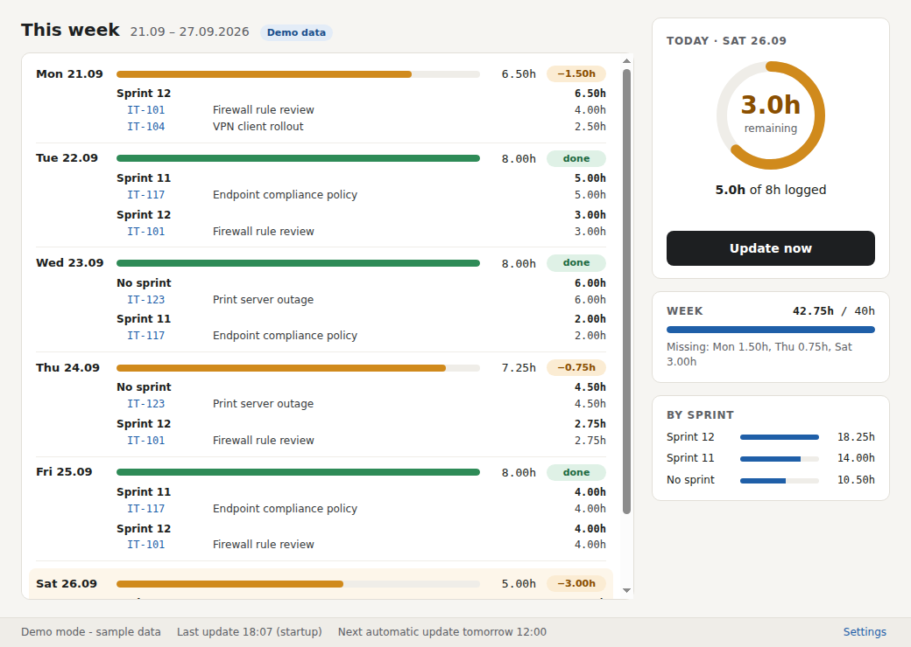
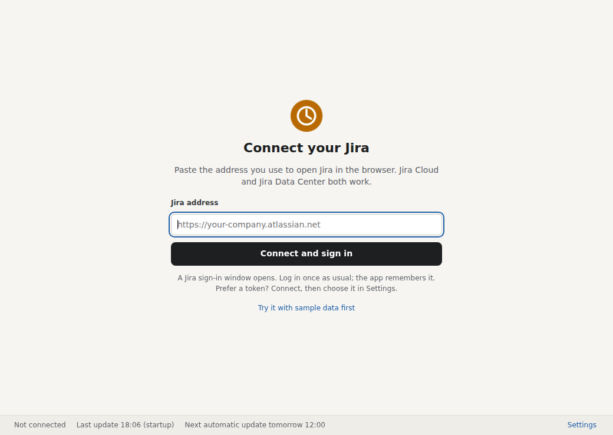

# Jira Week Hours

A small Windows tray app that answers one question: **have I logged my hours in Jira today?**

Jira stores every worklog, but it has no personal day or week view. Jira Week Hours reads your own worklogs and shows how many hours you logged today, how many are still missing against your daily target, and your week by day, sprint and ticket.



## Features

- **Tray icon** with the hours still missing today; a green check once you reach your target.
- **Week view**: every day with its sprints, tickets and hours, plus weekly totals per sprint.
- **Automatic updates** at fixed times (default 12:00 and 16:00) with a reminder if hours are missing. "Update now" works any time.
- **Works with Jira Cloud and Jira Data Center.** Paste your Jira address; the app detects which one it is.
- **Start with Windows**, and closing the window keeps it running in the tray.
- **Read-only.** It never changes anything in Jira and only reads your own worklogs.

## Install

1. Download `JiraWeekHours-Setup.exe` from the [Releases](../../releases) page.
2. Run it. It installs for your user only, with no admin rights, and adds a Start menu entry.
3. Windows SmartScreen may warn because the installer is not code-signed. Click **More info**, then **Run anyway**.

## Connect your Jira

On first start, paste the address you use to open Jira in the browser, for example `https://your-company.atlassian.net` or `https://jira.your-company.com`. A board or ticket link works too; the app keeps just the base address.



Then sign in one of two ways:

| Option | How |
|---|---|
| **Sign in with Jira window** (default) | A Jira window opens. Log in as usual, including company single sign-on. The app remembers the session. |
| **API token**, Jira Cloud | Create a token at [id.atlassian.com › Security › API tokens](https://id.atlassian.com/manage-profile/security/api-tokens). In Settings, choose *API token* and enter your e-mail and the token. |
| **Personal access token**, Jira Data Center | In Jira: your profile › *Personal Access Tokens*. In Settings, choose *API token*, leave the e-mail empty and paste the token. |

Some single sign-on providers (Google in particular) refuse sign-in from embedded windows. If the sign-in window does not work, use a token instead.

**Try it without Jira:** choose *Try it with sample data first* on the connect screen, or tick *Demo mode* in Settings.

## Settings

| Setting | Default | Notes |
|---|---|---|
| Daily target | 8 h | Monday to Friday |
| Automatic updates | 12:00, 16:00 | Any list of times, e.g. `10:00, 12:00, 16:00` |
| Group hours by | Sprint | Also issue type, project, component, labels or any custom field (`customfield_12345`) |

**Disconnect Jira** in Settings signs out, removes the saved token and lets you connect another Jira.

## Privacy

- The app talks only to your Jira. No cloud service, no telemetry, no third parties.
- Settings are stored in `%APPDATA%\Jira Week Hours\settings.json`.
- A token is encrypted with Windows' user data protection and can only be read by your Windows account.
- Jira administrators can see the REST calls in their logs, as with any Jira access.

## How it works

1. Detects Jira Cloud or Data Center via `/rest/api/2/serverInfo`.
2. Finds the issues you logged time on this week: JQL `worklogAuthor = currentUser() AND worklogDate >= <Monday>`, using `/rest/api/3/search/jql` on Cloud and `/rest/api/2/search` on Data Center.
3. Reads each issue's worklogs, keeps your own entries for this week and sums them per day, sprint and ticket.
4. Finds the Sprint field by its type, since its ID differs between Jira installations.

## Build from source

Needs [Node.js](https://nodejs.org/) 20 or newer.

```bash
npm install
npm start        # run the app
npm test         # tests against fake Jira Cloud and Data Center servers
npm run make     # build the installer (on Windows)
```

The installer ends up in `out/make/squirrel.windows/x64/JiraWeekHours-Setup.exe`, plus a portable zip in `out/make/zip/`.

### Automatic builds on GitHub

`.github/workflows/build.yml` runs the tests and builds the installer on every push to `main`. The installer is attached to the workflow run as an artifact.

To publish a release with the installer attached:

```bash
git tag v1.0.0
git push origin v1.0.0
```

## Project layout

```
src/main.js        tray icon, window, sign-in window, scheduled updates
src/core.js        Jira access (Cloud + Data Center), week report, demo data
src/squirrel.js    installer events (shortcuts on install, cleanup on uninstall)
src/autostart.js   "Start with Windows"
src/preload.js     safe bridge between the window and the app
src/ui/            window (HTML, CSS, JS) and icons
test/              tests with fake Jira servers
forge.config.js    Electron Forge: Setup.exe and zip
```

## License

[MIT](LICENSE)
